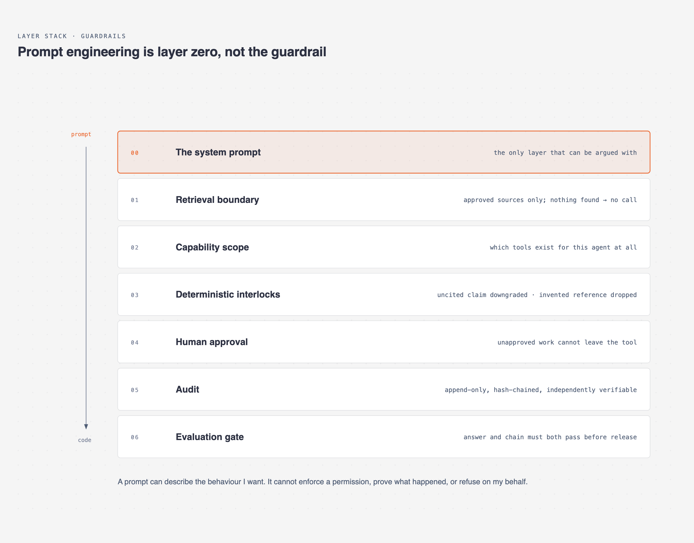
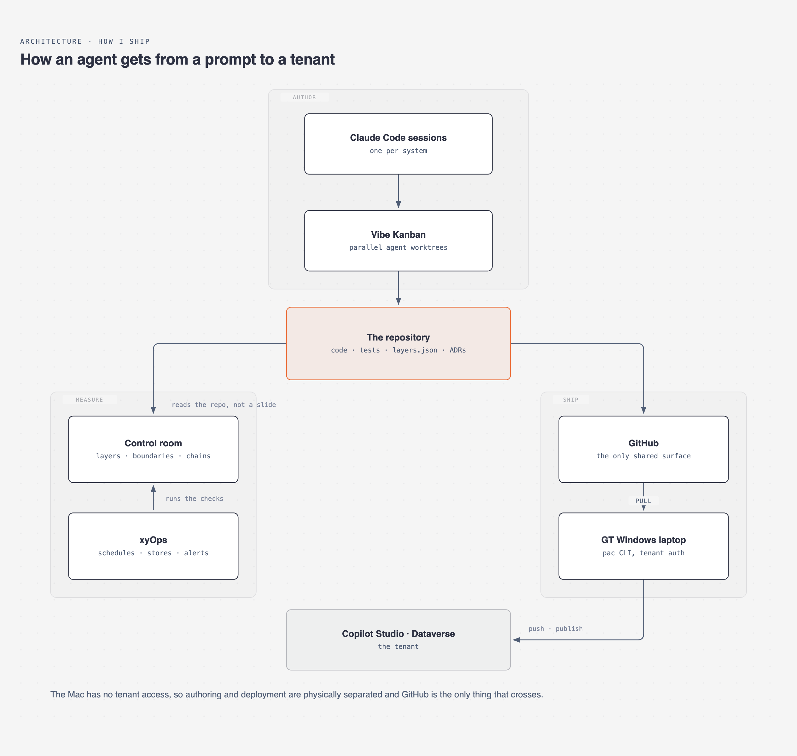
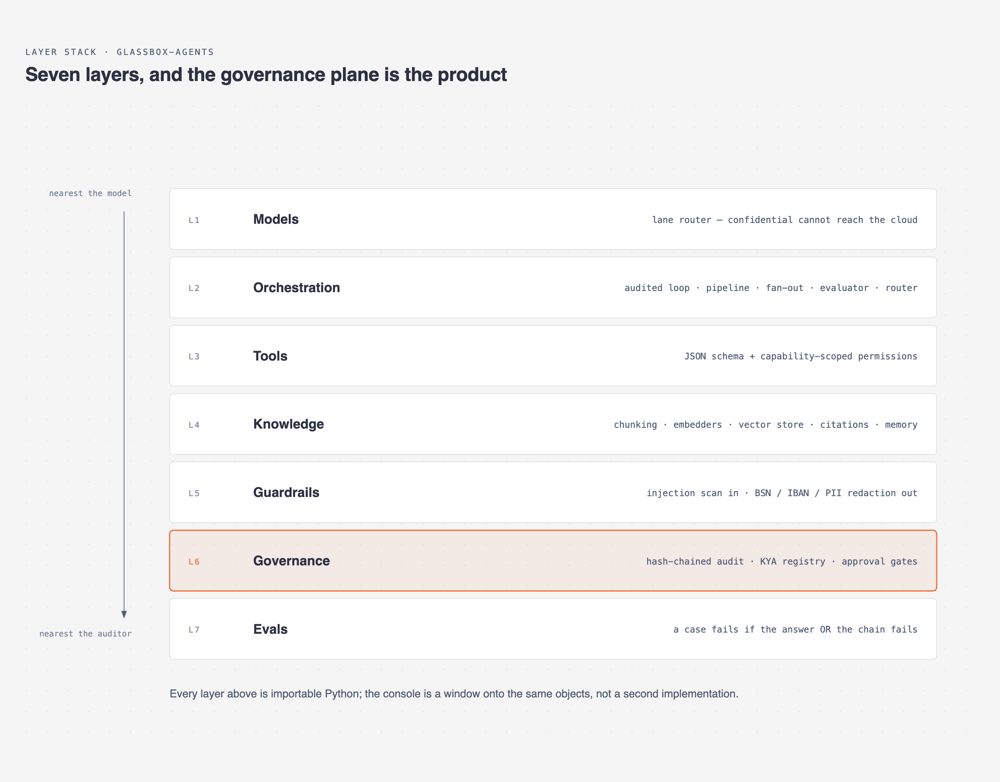
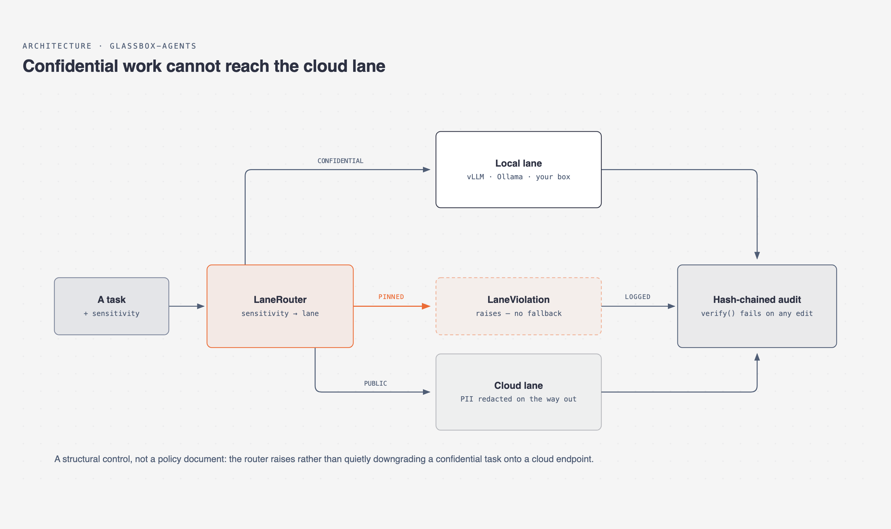
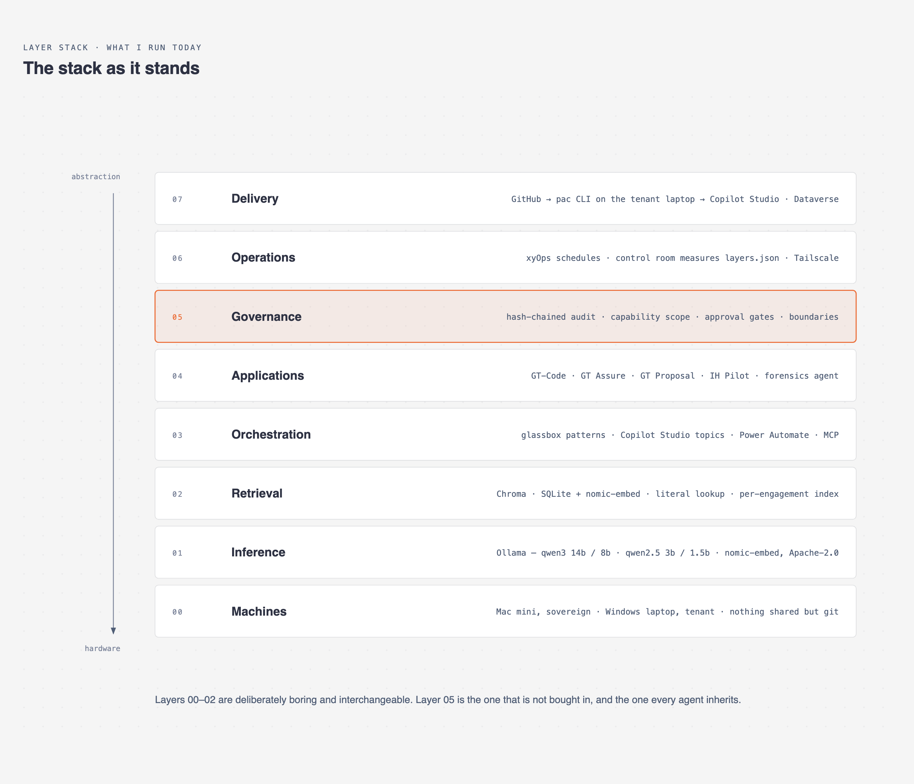
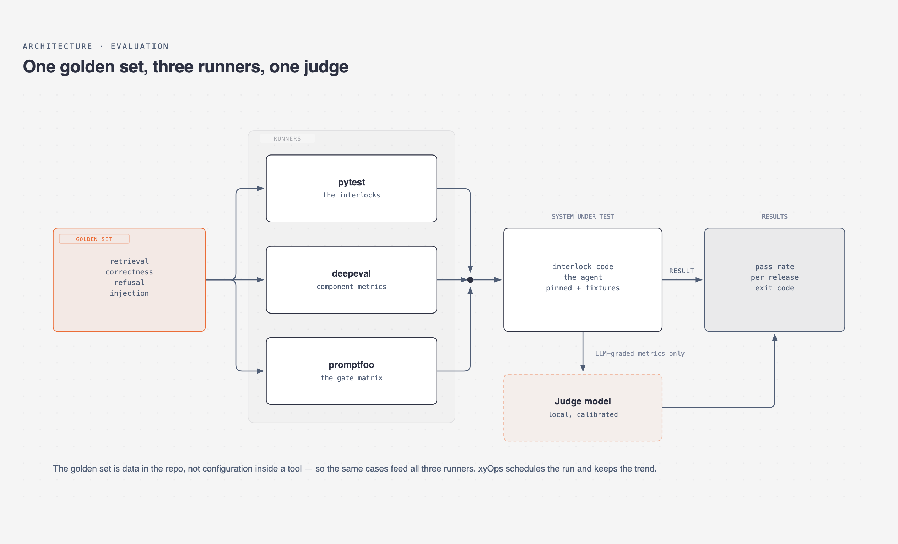
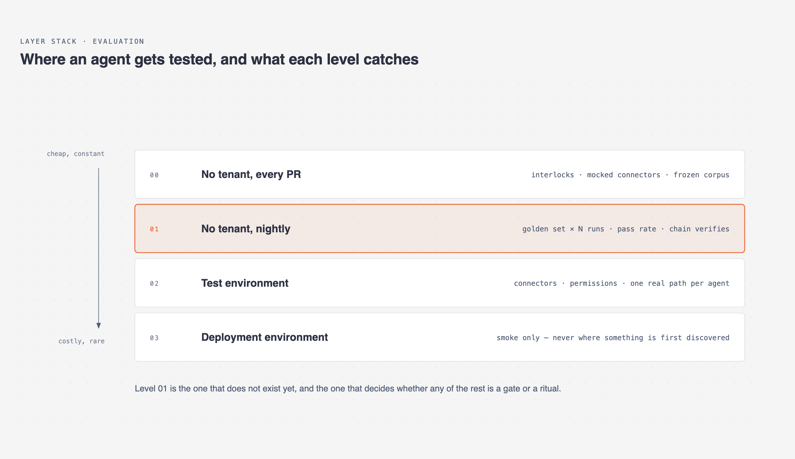

# Agentic architecture

**How I design, guard and ship AI agents for a professional-services firm — as diagrams and
short architecture notes rather than a slide deck.**

I build agentic systems for Grant Thornton Netherlands: a local coding agent, a control-testing
tool for assurance, a proposal drafting and pricing tool, and the platform layer underneath
them. This repository is the architecture of that work in one place, so a reviewer can argue
with the design without reading four codebases first.

Everything here is architecture and reasoning. No client data, no evidence, no fees, no
proposals. The tools themselves ship with synthetic data for exactly the same reason.

---

## The four notes

Each is 3–6 pages and mostly diagrams and tables — the structure carries the argument, and
each ends with an honest section on what I would want pushed on.

| Note | What it covers | Source repo |
|---|---|---|
| **[GT-Code](pdf/gt-code.pdf)** | A coding agent that never leaves the machine: local model ladder, permission gate, confidence gate before a build | [`Starfish124/GT-code`](https://github.com/Starfish124/GT-code) |
| **[GT Assure](pdf/gt-assure.pdf)** | AI-assisted control testing and sample testing, with the judgement left with a named reviewer | [`Starfish124/gt-assure`](https://github.com/Starfish124/gt-assure) |
| **[GT Proposal](pdf/gt-proposal.pdf)** | Proposal drafting from won bids and pricing from recorded actuals — the model selects, the code counts | [`Starfish124/gt-proposal`](https://github.com/Starfish124/gt-proposal) |
| **[Glassbox agents](pdf/glassbox-agents.pdf)** | The two-lane platform blueprint, the reference implementation, the stack I run, and how an agent reaches a tenant | [`Starfish124/glassbox-agents`](https://github.com/Starfish124/glassbox-agents) |
| **[Testing complex agents](pdf/testing-agents.pdf)** | Golden sets, the eval harness (pytest · deepeval · promptfoo), where each test level runs, and the orchestration decision | — |

Also in the family, and covered inside the notes rather than in their own: 
[`gt-code-ih-pilot`](https://github.com/Starfish124/gt-code-ih-pilot) — offline, cited literature
analysis for Impact House — and [`gt-copilot`](https://github.com/Starfish124/gt-copilot), the
Copilot Studio lane where the forensics agent lives. Those repositories are private; ask me for
access.

---

## Where I stand on guardrails

I do not treat prompt engineering as a guardrail. A prompt is the right place to describe the
behaviour I want, and it is the layer a model can be argued out of — by a user, by a document
it retrieved, or by its own drift. It cannot enforce a permission, prevent a tool call, prove
what happened afterwards, or refuse on my behalf.



The test I apply: **if the model ignored every word of its system prompt, what would still stop
it?** Whatever survives that question is the guardrail. The rest is a preference.

Every interlock across these four systems is an instance of it, and each was written after
watching a model do the thing it now prevents:

- a destructive-command check that overrides a standing grant and auto-approve alike;
- an empty retrieval that skips the second model call entirely, rather than letting a model
  assess a control from general knowledge;
- a citation outside the supplied range, discarded — the model cannot cite a document it was
  never shown;
- a past client's name in a draft, which **refuses** approval rather than warning about it;
- a confidential task pinned to a cloud lane, which raises rather than falling back.

---

## How I ship an agent

Authoring and deployment are physically separated, because the machine I author on has no
tenant access and the machine with tenant access is not where I want an agent writing code.
GitHub is the only thing that crosses.



The part I would defend hardest: the control room measures **the repository**, not a status
slide. Each system declares its boundary in a `layers.json` before it has code — what it reads,
with which permission, where the data sits, what leaves the tenant — and the measurement plane
checks that claim against the code. A boundary nothing satisfies shows up red, and so does a
test whose last line is a failure.

---

## The platform underneath





---

## The stack I run on

Layers 00–02 are deliberately unremarkable and interchangeable — open-weight models on Ollama,
plain vector stores, nothing I could not replace in a week. Layer 05 is the one that is not
bought in, and the one every new agent inherits for free.



---

## How agents get tested

The golden set is data in the repository, not configuration inside a tool, so the same cases feed
every runner and survive a tool change. `pytest` covers the interlocks, `deepeval` the component
metrics — retrieval quality measured separately from answer quality — and `promptfoo` the gate
matrix, refusal cases and red-team suites.





Cases run N times and gate on a **pass rate**, not pass/fail. A single-run gate on a flaky case
goes red or green at random, and a case dropping from ten out of ten to seven has regressed while
still "passing".

---

## Every diagram

| | |
|---|---|
| [GT-Code architecture](diagrams/png/gt-code-architecture.png) | [GT-Code request lifecycle](diagrams/png/gt-code-lifecycle.png) |
| [GT Assure architecture](diagrams/png/gt-assure-architecture.png) | [GT Assure per-control pipeline](diagrams/png/gt-assure-control.png) |
| [GT Proposal architecture](diagrams/png/gt-proposal-architecture.png) | [GT Proposal interlocks](diagrams/png/gt-proposal-interlocks.png) |
| [Glassbox layer stack](diagrams/png/glassbox-layers.png) | [Two-lane routing](diagrams/png/glassbox-lanes.png) |
| [Guardrail layers](diagrams/png/guardrails.png) | [Delivery stack](diagrams/png/delivery-stack.png) |
| [Current stack](diagrams/png/current-stack.png) | [Eval harness](diagrams/png/eval-harness.png) |
| [Test levels](diagrams/png/test-levels.png) | |

---

## Building it

The diagrams are generated, not drawn, so a diagram and the note that explains it cannot drift
apart. `tools/skin.py` is the renderer; `tools/diagrams.py` is the one file that defines all thirteen.

```bash
python3 tools/diagrams.py     # diagrams/*.html
python3 tools/export_png.py   # diagrams/png/*.png  (needs Chrome)
python3 tools/build_pdf.py    # pdf/*.pdf, inlining each diagram's SVG into the note
```

No dependencies beyond the standard library and a local Chrome for rendering.

The visual language follows [`cathrynlavery/diagram-design`](https://github.com/cathrynlavery/diagram-design)
(MIT) — one accent per diagram, orthogonal connectors, a 4px grid. Two type families, no serif.

---

## Licence

Apache-2.0 for the code in `tools/`. The architecture notes and diagrams are CC BY 4.0 — use
them, credit them.
